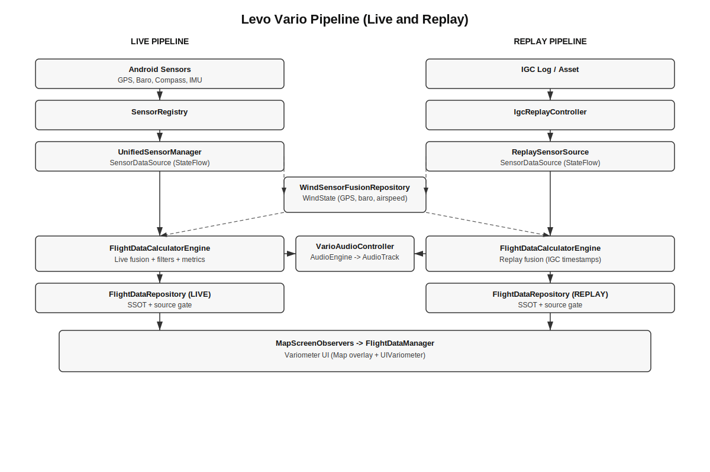

# Levo Vario Architecture and Data Flow

This document is a detailed map of the Levo variometer pipeline in XCPro.
It describes the end to end data flow from Android sensors through fusion,
filtering, replay, audio, and UI rendering.

It is intentionally verbose so future agents can understand the full chain
without relying on memory.

------------------------------------------------------------------------------
REQUIRED READING (READ IN ORDER BEFORE CHANGES)
------------------------------------------------------------------------------
1) ARCHITECTURE.md
2) CODING_RULES.md
3) CONTRIBUTING.md

These define non negotiable rules for SSOT, UDF, DI, threading, services,
and testing. This doc does not replace those rules.

Related docs that provide context:
- ARCHITECTURE_DECISIONS.md
- REFACTOR.md
- REFACTOR_GEOPOINT.md
- levo-replay.md (replay debugging context)
- PhoneElectronicVarioCalc_TE.md (algorithm notes)
- README.md (this folder's index)

------------------------------------------------------------------------------
SCOPE
------------------------------------------------------------------------------
Levo Vario includes:
- Live sensor ingestion (GPS, barometer, compass, IMU)
- Fusion and filtering for vario, TE, netto, thermal metrics
- Replay mode (IGC playback) and live/replay switching
- Audio mapping and playback
- UI display (variometer widget overlay and cards)
- Settings (MacCready, audio thresholds) and diagnostics

This doc focuses on the Levo pipeline, not the entire app. It assumes the
core architecture rules described in ARCHITECTURE.md.

------------------------------------------------------------------------------
HIGH LEVEL DATA FLOW (LIVE)
------------------------------------------------------------------------------

Android sensors
  -> SensorRegistry (wires Android APIs)
  -> UnifiedSensorManager (StateFlow for each sensor)
  -> FlightDataCalculatorEngine (fusion, filters, metrics, audio)
  -> FlightDataRepository (SSOT for UI, LIVE source)
  -> MapScreenObservers (convert to RealTimeFlightData)
  -> FlightDataManager (UI smoothing/throttle/bucket)
  -> Map UI (VariometerPanel -> VariometerWidget -> UIVariometer)

Audio path (parallel to UI):
  FlightDataCalculatorEngine
    -> VarioAudioController
      -> VarioAudioEngine (mapping + beep control)
        -> AudioTrack (VarioToneGenerator)

------------------------------------------------------------------------------
ARCHITECTURE DIAGRAM
------------------------------------------------------------------------------

Levo Vario pipeline overview (live and replay):

Replay path (parallel to live):
  IGC file
    -> IgcReplayController
      -> ReplaySensorSource (fake sensors)
        -> FlightDataCalculatorEngine (isReplayMode = true)
          -> FlightDataRepository (REPLAY source)

------------------------------------------------------------------------------
KEY MODULES AND FILES
------------------------------------------------------------------------------
App layer:
- app/src/main/java/com/example/xcpro/MainActivity.kt
- app/src/main/java/com/example/xcpro/service/VarioForegroundService.kt
- app/src/main/java/com/example/xcpro/di/AppModule.kt

Sensors + fusion (feature/map):
- feature/map/src/main/java/com/example/xcpro/sensors/*
- feature/map/src/main/java/com/example/xcpro/vario/*
- feature/map/src/main/java/com/example/xcpro/flightdata/*
- feature/map/src/main/java/com/example/xcpro/replay/*
- feature/map/src/main/java/com/example/xcpro/sensors/NeedleVarioDynamics.kt (pneumatic needle response)

Audio:
- feature/map/src/main/java/com/example/xcpro/audio/*

UI (map overlay and variometer):
- feature/map/src/main/java/com/example/xcpro/map/*
- feature/map/src/main/java/com/example/xcpro/map/ui/*
- feature/variometer/src/main/java/com/example/ui1/UIVariometer.kt
- feature/variometer/src/main/java/com/example/xcpro/variometer/layout/*

Wind and airspeed (used by TE/netto and cards):
- feature/map/src/main/java/com/example/xcpro/weather/wind/*

Library filters and calculators:
- dfcards-library/src/main/java/com/example/dfcards/filters/*
- dfcards-library/src/main/java/com/example/dfcards/dfcards/calculations/*

Tests:
- feature/map/src/test/java/com/example/xcpro/sensors/LevoVarioPipelineTest.kt
- feature/map/src/test/java/com/example/xcpro/sensors/DisplayVarioSmootherTest.kt
- feature/map/src/test/java/com/example/xcpro/sensors/domain/SensorFrontEndTest.kt
- feature/map/src/test/java/com/example/xcpro/vario/GPSVarioTest.kt

------------------------------------------------------------------------------
ENTRY POINTS AND LIFECYCLE
------------------------------------------------------------------------------
1) MainActivity requests location permission and starts the foreground service
   when permission is granted.
   File: app/src/main/java/com/example/xcpro/MainActivity.kt

2) VarioForegroundService owns the lifecycle of the vario pipeline.
   - On create, it creates a foreground notification and calls manager.start().
   - On destroy, it stops the sensor pipeline.
   File: app/src/main/java/com/example/xcpro/service/VarioForegroundService.kt

3) VarioServiceManager is the application-wide owner of the sensor pipeline.
   It is injected into the service and UI.
   File: feature/map/src/main/java/com/example/xcpro/vario/VarioServiceManager.kt

Responsibilities:
- Build the SensorFusionRepository (FlightDataCalculator)
- Start and stop sensors on the main thread
- Retry sensor start if permission is missing (SensorRetryCoordinator)
- Collect flightDataFlow and push into FlightDataRepository
- Observe Levo config (MacCready) and push into the fusion engine

------------------------------------------------------------------------------
SENSOR LAYER (LIVE)
------------------------------------------------------------------------------
UnifiedSensorManager is the primary live SensorDataSource.
File: feature/map/src/main/java/com/example/xcpro/sensors/UnifiedSensorManager.kt

It exposes StateFlow for:
- gpsFlow: GPSData from LocationManager
- baroFlow: BaroData from pressure sensor
- compassFlow: CompassData from magnetic sensor
- rawAccelFlow: RawAccelData from accelerometer
- accelFlow: AccelData from linear acceleration (earth frame)
- attitudeFlow: AttitudeData from rotation vector

SensorRegistry wires Android APIs and pushes raw updates into callbacks.
File: feature/map/src/main/java/com/example/xcpro/sensors/SensorRegistry.kt

Sampling and sensors:
- GPS update interval: 1000 ms, min distance 0 m
- Barometer: SENSOR_DELAY_GAME
- Compass: SENSOR_DELAY_UI
- Linear accel: SENSOR_DELAY_GAME
- Rotation vector: SENSOR_DELAY_GAME

OrientationProcessor projects linear acceleration into earth Z.
File: feature/map/src/main/java/com/example/xcpro/sensors/OrientationProcessor.kt

Reliability:
- AccelData.isReliable is true only when rotation vector is fresh.
- CompassData includes accuracy and is filtered in wind input adapter.

Sensor models are defined in:
feature/map/src/main/java/com/example/xcpro/sensors/SensorData.kt

Time base note (live):
- Sensor models carry wall time (timestamp) and monotonic time (monotonicTimestampMillis).
- Fusion and validity windows use monotonic time to avoid clock jumps.
- Output timestamps stay in wall time for UI and for manual wind comparisons.

------------------------------------------------------------------------------
FUSION AND FILTERING PIPELINE
------------------------------------------------------------------------------
The fusion engine is FlightDataCalculatorEngine.
File: feature/map/src/main/java/com/example/xcpro/sensors/FlightDataCalculatorEngine.kt

It is wrapped by FlightDataCalculator, which is the SensorFusionRepository.
File: feature/map/src/main/java/com/example/xcpro/sensors/FlightDataCalculator.kt

Key responsibilities:
- Fuse baro, GPS, compass, IMU into a single CompleteFlightData SSOT
- Run vario filters (Kalman, raw, complementary, GPS)
- Compute metrics (TE vario, netto, thermal averages, AGL, LD)
- Emit display frames and drive audio
- Support replay mode with deterministic timestamps

The engine uses two loops with decoupled cadences:

1) High rate vario loop (baro + IMU)
   Source: baroFlow + accelFlow
   File: feature/map/src/main/java/com/example/xcpro/sensors/FlightDataCalculatorEngineLoops.kt
   Function: updateVarioFilter(...)

   Steps:
   - Only advance the vario loop when a new baro sample arrives (avoid IMU-only ticks that can invent lift/sink).
   - Use baro timestamp in replay mode for deterministic time.
   - Smooth pressure via PressureKalmanFilter.
   - Run BarometricAltitudeCalculator (QNH, pressure altitude, confidence).
   - Detect QNH jumps; reset vario filters if needed (live only).
   - Compute verticalAccel for fusion (clamped, smoothed).
   - Update VarioSuite (optimized, legacy, raw, complementary).
   - Run AdvancedBarometricFilter (dfcards) for display altitude and vario.
   - Update audio based on TE or raw vario.
   - Emit display frames at a throttled cadence if GPS cache is present.

2) GPS loop (GPS + compass)
   Source: gpsFlow + compassFlow
   File: feature/map/src/main/java/com/example/xcpro/sensors/FlightDataCalculatorEngineLoops.kt
   Function: updateGPSData(...)

   Steps:
   - Update cached GPS values for the vario loop.
   - Update GPS vario (linear regression in GPSVario).
   - If baro loop is stale or missing, emit a UI frame based on GPS vario.

Key internal components:
- FlightDataEmitter: builds CompleteFlightData and pushes it to StateFlow.
  File: feature/map/src/main/java/com/example/xcpro/sensors/FlightDataEmitter.kt
- FlightCalculationHelpers: AGL, LD, netto, thermal tracking.
  File: feature/map/src/main/java/com/example/xcpro/sensors/FlightCalculationHelpers.kt
- CalculateFlightMetricsUseCase: domain metrics, TE, smoothing.
  File: feature/map/src/main/java/com/example/xcpro/sensors/domain/CalculateFlightMetricsUseCase.kt

------------------------------------------------------------------------------
BARO AND QNH PATH
------------------------------------------------------------------------------
Pressure smoothing:
- PressureKalmanFilter (1D, pressure domain)
  File: feature/map/src/main/java/com/example/xcpro/sensors/PressureKalmanFilter.kt

Barometric altitude and QNH:
- BarometricAltitudeCalculator (dfcards library)
  File: dfcards-library/src/main/java/com/example/dfcards/dfcards/calculations/CalcBaroAltitude.kt

Highlights:
- Uses averaged samples (15) for initial QNH calibration.
- Can use SRTM terrain (SimpleAglCalculator) for better QNH.
- Auto calibration is time-limited (engine handles session timeout).
- Manual QNH overrides disable auto.

Note: In live mode, a QNH jump triggers a reset of vario filters to
avoid false vertical speed spikes. In replay mode, QNH jumps are logged
but not reset to keep replay stable.

------------------------------------------------------------------------------
VARIO FILTER SUITE
------------------------------------------------------------------------------
VarioSuite owns multiple implementations.
File: feature/map/src/main/java/com/example/xcpro/sensors/VarioSuite.kt

Implementations:
- OptimizedKalmanVario: Modern3StateKalmanFilter (dfcards)
  File: feature/map/src/main/java/com/example/xcpro/vario/OptimizedKalmanVario.kt
- LegacyKalmanVario: original 3-state Kalman
  File: feature/map/src/main/java/com/example/xcpro/vario/LegacyKalmanVario.kt
- RawBaroVario: plain differentiation
  File: feature/map/src/main/java/com/example/xcpro/vario/RawBaroVario.kt
- GPSVario: regression over GPS altitude window
  File: feature/map/src/main/java/com/example/xcpro/vario/GPSVario.kt
- ComplementaryVario: complementary filter (dfcards)
  File: feature/map/src/main/java/com/example/xcpro/vario/ComplementaryVario.kt

The engine selects the display vario using the domain logic in
SensorFrontEnd (see next section). The suite outputs are also exposed
in CompleteFlightData for diagnostics and comparison.

------------------------------------------------------------------------------
METRICS AND VARIO SELECTION
------------------------------------------------------------------------------
CalculateFlightMetricsUseCase is the core domain computation.
File: feature/map/src/main/java/com/example/xcpro/sensors/domain/CalculateFlightMetricsUseCase.kt

Key steps:
- Build SensorFrontEnd snapshot (nav altitude, vario derivatives, TE vario).
- Select brutto vario priority:
  TE -> PRESSURE -> BARO -> GPS (first valid wins).
- Compute TE vario only when airspeed is real and above thresholds.
- Compute netto (sink compensation) using polar and airspeed.
- Smooth display vario and display netto with DisplayVarioSmoother.
- Compute a pneumatic-style needle value (displayNeedleVario) with a
  deterministic response (95% in 0.6s, no overshoot). This value uses
  bruttoVario as its target and is for the needle only; numeric/audio
  remain on displayVario.
- Maintain 30s rolling averages (FusionBlackboard).
- Detect circling (CirclingDetector) to reset averages and thermal state.

SensorFrontEnd is the source of truth for derived fundamentals:
File: feature/map/src/main/java/com/example/xcpro/sensors/domain/SensorFrontEnd.kt

It handles:
- nav altitude selection (baro vs GPS depending on calibration)
- pressure and baro vario derivatives with time guards
- GPS vario with small median window
- TE altitude (energy height)

Important: vario validity is time based. The engine sets
emissionState.varioValidUntil based on sample cadence, and audio/UI
use this to decide when to silence or fall back.

------------------------------------------------------------------------------
DATA EMISSION AND SSOT
------------------------------------------------------------------------------
CompleteFlightData is the single source of truth for UI and downstream logic.
File: feature/map/src/main/java/com/example/xcpro/sensors/SensorData.kt

FlightDataEmitter builds CompleteFlightData from:
- GPS/Baro/Compass (raw sensors)
- FlightMetricsResult (domain use case)
- VarioSuite results (for diagnostics)
- MacCready settings
- AGL from FlightCalculationHelpers

FlightDataRepository is the SSOT exposed to UI.
File: feature/map/src/main/java/com/example/xcpro/flightdata/FlightDataRepository.kt

It gates updates by source:
- Source.LIVE: normal sensor pipeline
- Source.REPLAY: replay pipeline

This prevents live updates from overwriting replay samples.

------------------------------------------------------------------------------
REPLAY MODE
------------------------------------------------------------------------------
Replay is orchestrated by IgcReplayController.
File: feature/map/src/main/java/com/example/xcpro/replay/IgcReplayController.kt

Key behaviors:
- Creates a replay SensorFusionRepository with isReplayMode = true.
- Suspends live sensors via VarioServiceManager.stop().
- Uses ReplaySensorSource as the SensorDataSource.
- Uses ReplaySampleEmitter to emit baro, GPS, compass samples at
  configured cadence, with optional noise and jitter.
- Uses IGC timestamps as the simulation clock.
- Pushes replay CompleteFlightData into FlightDataRepository (REPLAY).
- On stop or finish, resets replay fusion, clears repository, and
  switches back to LIVE.

Replay data sources:
- ReplaySensorSource: emits GPS, baro, compass.
  File: feature/map/src/main/java/com/example/xcpro/replay/ReplaySensorSource.kt
- ReplaySampleEmitter: converts IGC points into sensor samples.
  File: feature/map/src/main/java/com/example/xcpro/replay/ReplaySampleEmitter.kt

Note: Replay also supports a "real time sim" mode that adds noise
and cadence differences to better match live sensor behavior.

Time base note (replay vs live):
- Replay uses IGC timestamps as the simulation clock for fusion timing.
- Live uses monotonic time for delta calculations but emits wall time for UI/output.

------------------------------------------------------------------------------
WIND AND AIRSPEED (USED BY TE AND NETTO)
------------------------------------------------------------------------------
WindSensorFusionRepository fuses GPS, pressure, heading, g-load and
airspeed to estimate wind.
File: feature/map/src/main/java/com/example/xcpro/weather/wind/data/WindSensorFusionRepository.kt

Wind inputs are adapted from SensorDataSource via:
feature/map/src/main/java/com/example/xcpro/weather/wind/data/WindSensorInputAdapter.kt

Wind state is consumed by:
- FlightDataCalculatorEngine (for metrics and UI labels)
- MapScreenObservers (to add wind data to RealTimeFlightData)

Airspeed:
- Live airspeed comes from ExternalAirspeedRepository (if present).
- Replay airspeed comes from ReplayAirspeedRepository.
- WindEstimator in CalculateFlightMetricsUseCase uses WindState to
  compute true/indicated airspeed (or falls back to GPS ground speed).

------------------------------------------------------------------------------
AUDIO PIPELINE
------------------------------------------------------------------------------
Audio is driven directly from the fusion engine:
- FlightDataCalculatorEngine -> VarioAudioController -> VarioAudioEngine

File references:
- feature/map/src/main/java/com/example/xcpro/audio/VarioAudioController.kt
- feature/map/src/main/java/com/example/xcpro/audio/VarioAudioEngine.kt
- feature/map/src/main/java/com/example/xcpro/audio/VarioFrequencyMapper.kt
- feature/map/src/main/java/com/example/xcpro/audio/VarioBeepController.kt
- feature/map/src/main/java/com/example/xcpro/audio/VarioToneGenerator.kt

Behavior:
- TE vario is preferred when valid; otherwise raw vario.
- If no valid vario, engine is forced to silence.
- FrequencyMapper maps vertical speed to tone params.
- BeepController smooths transitions and handles duty cycle.
- ToneGenerator uses AudioTrack with low latency.

Audio settings flow:
- VarioAudioEngine stores settings as StateFlow.
- LevoVarioSettingsViewModel updates settings via
  VarioServiceManager.sensorFusionRepository.updateAudioSettings(...)

------------------------------------------------------------------------------
UI PIPELINE (VARIO DISPLAY)
------------------------------------------------------------------------------
Flow from fused data to UI:

FlightDataRepository (CompleteFlightData)
  -> MapScreenObservers converts to RealTimeFlightData
     (MapScreenUtils.convertToRealTimeFlightData)
  -> FlightDataManager exposes displayVarioFlow and xcSoarDisplayVarioFlow
     with bucketing and throttle
  -> VariometerPanel renders VariometerWidget with needle and labels
  -> UIVariometer draws the dial and needle

Key files:
- feature/map/src/main/java/com/example/xcpro/map/MapScreenViewModel.kt
- feature/map/src/main/java/com/example/xcpro/map/MapScreenObservers.kt
- feature/map/src/main/java/com/example/xcpro/MapScreenUtils.kt
- feature/map/src/main/java/com/example/xcpro/map/FlightDataManager.kt
- feature/map/src/main/java/com/example/xcpro/map/ui/OverlayPanels.kt
- feature/map/src/main/java/com/example/xcpro/map/ui/widgets/VariometerWidgetImpl.kt
- feature/variometer/src/main/java/com/example/ui1/UIVariometer.kt

Display rules:
- displayVarioFlow chooses displayVario when valid, else fall back to
  verticalSpeed (raw) if needed.
- needleVarioFlow uses displayNeedleVario (pneumatic response) for the
  UI needle only. Compose does not add extra smoothing.
- Numeric values are bucketed to 0.1 m/s and throttled to ~12 Hz; the
  needle uses a higher cadence (~30 Hz) without bucketing.
- VariometerPanel converts values to user units and renders the needle.
- Secondary label shows XCSoar-style display vario for comparison.

Purple needle note (audio input):
- The purple needle shows the audio *input* vario (TE when valid, else raw),
  not the audio output tone. This is why it can move even when audio is silent.
- On phone-only sensors, airspeed usually falls back to GPS ground speed, which
  disables TE vario. In that case audio input falls back to raw/brutto vario,
  so the purple needle tracks the blue/red needles closely.
- Red vs blue divergence is subtle because their time constants are close
  (0.6s vs 0.4s), and both are throttled to ~30 Hz in FlightDataManager.
- Full details: docs/LevoVario/PurpleNeedle.md

------------------------------------------------------------------------------
VARIOMETER WIDGET LAYOUT AND PERSISTENCE
------------------------------------------------------------------------------
Widget layout is stored in SharedPreferences and surfaced as StateFlow.

Files:
- feature/variometer/src/main/java/com/example/xcpro/variometer/layout/VariometerWidgetRepository.kt
- feature/variometer/src/main/java/com/example/xcpro/variometer/layout/VariometerLayout.kt
- feature/map/src/main/java/com/example/xcpro/map/VariometerLayoutController.kt

Behavior:
- Layout is persisted under keys "uilevo_x", "uilevo_y", "uilevo_size".
- Legacy keys are supported for migration.
- UI can enter edit mode to drag and resize the widget.
- Bounds are clamped to screen size.

------------------------------------------------------------------------------
SETTINGS AND PREFERENCES
------------------------------------------------------------------------------
Levo settings UI:
- LevoVarioSettingsScreen and LevoVarioSettingsViewModel
  feature/map/src/main/java/com/example/xcpro/screens/navdrawer/

MacCready preferences:
- LevoVarioPreferencesRepository (DataStore)
  feature/map/src/main/java/com/example/xcpro/vario/LevoVarioPreferencesRepository.kt
- VarioServiceManager listens to config and updates the fusion engine.

Audio preferences:
- Stored in VarioAudioEngine settings StateFlow.
- Updated via LevoVarioSettingsViewModel.

------------------------------------------------------------------------------
DI AND SOURCE SWITCHING
------------------------------------------------------------------------------
Hilt binds live and replay sources.
See: feature/map/src/main/java/com/example/xcpro/di/WindSensorModule.kt

Bindings:
- @LiveSource SensorDataSource -> UnifiedSensorManager
- @ReplaySource SensorDataSource -> ReplaySensorSource
- @LiveSource AirspeedDataSource -> ExternalAirspeedRepository
- @ReplaySource AirspeedDataSource -> ReplayAirspeedRepository

This enables replay and live pipelines to share the same fusion code.

------------------------------------------------------------------------------
DIAGNOSTICS
------------------------------------------------------------------------------
Diagnostics screen:
- VarioDiagnosticsScreen and VarioDiagnosticsViewModel
  feature/map/src/main/java/com/example/xcpro/screens/diagnostics/

Diagnostics data model:
- VarioDiagnosticsSample (contains VarioFilterDiagnostics)
  feature/map/src/main/java/com/example/xcpro/sensors/VarioDiagnosticsSample.kt

Current behavior:
- diagnosticsFlow is populated in the baro/IMU loop by pulling diagnostics
  from the optimized Kalman filter (Modern3StateKalmanFilter).
- Samples include TE vario (when available) and the optimized filter
  vertical speed plus diagnostics metadata.

------------------------------------------------------------------------------
COMMON PITFALLS AND INVARIANTS
------------------------------------------------------------------------------
- Do not bypass FlightDataRepository (SSOT) for UI.
- Do not change UI to compute business logic; use use cases.
- Vario validity is time based. If you change cadence, update validity windows.
- QNH jumps reset filters in live mode. Preserve replay behavior.
- Use sensor timestamps in replay mode; do not mix with wall clock.
- Do not compare monotonic timestamps to wall time; manual wind timestamps are wall time.
- Do not reintroduce UI animation for the variometer needle; pneumatic
  response is in the domain pipeline (NeedleVarioDynamics).
- Do not log location data in release builds (see CODING_RULES).
- Avoid log spam in hot loops; keep logs gated or DEBUG-only.

------------------------------------------------------------------------------
CHANGE IMPACT MAP
------------------------------------------------------------------------------
If you change...

...sensor wiring:
  Check: SensorRegistry, UnifiedSensorManager, WindSensorInputAdapter,
  FlightStateRepository, replay sources.

...vario filters or fusion:
  Check: VarioSuite, FlightDataCalculatorEngineLoops,
  CalculateFlightMetricsUseCase, SensorFrontEnd,
  audio validity handling, tests in LevoVarioPipelineTest.

...QNH / baro:
  Check: BarometricAltitudeCalculator, PressureKalmanFilter,
  FlightDataCalculatorEngine QNH jump logic, MapScreenUtils QNH formatters.

...audio:
  Check: VarioAudioController, VarioAudioEngine, VarioFrequencyMapper,
  LevoVarioSettingsViewModel, settings UI.

...UI display:
  Check: FlightDataManager bucketing/throttle, VariometerPanel animations,
  UIVariometer dial config and units conversion.

...replay:
  Check: IgcReplayController, ReplaySampleEmitter, ReplaySensorSource,
  FlightDataRepository source gating, vario validity windows.

------------------------------------------------------------------------------
RECOMMENDED ADDITIONS FOR FUTURE AGENTS
------------------------------------------------------------------------------
These are not required but would reduce ramp up time and avoid regressions.

Completed:
- Architecture diagram added: docs/LevoVario/levo-architecture-diagram.svg
- Diagnostics flow wired in FlightDataCalculatorEngine using the optimized
  Kalman filter diagnostics.

Remaining recommendations:
1) Add a "Vario Filter Tuning Guide" that explains how to adjust
   Kalman parameters, display smoothing, and audio mapping, with
   expected impacts and test steps.

2) Add a replay regression test for end-to-end UI values (needle, display,
   audio state) using the vario demo IGC asset.

3) Add a "Known pitfalls" section to levo-replay.md that is kept up to date
   after each replay debugging session.

4) Add a small "Glossary" for terms like TE, brutto, netto, QNH, AGL,
   vario validity window, and macCready risk.

------------------------------------------------------------------------------
GLOSSARY (QUICK)
------------------------------------------------------------------------------
AGL: Altitude above ground level.
Brutto vario: Raw climb/sink (TE if available).
Netto: Brutto compensated by sink rate from polar.
QNH: Sea level pressure setting used to calibrate baro altitude.
TE: Total energy compensated vario (removes speed changes).
Vario validity window: Time window for which a vario sample is considered fresh.

End of document.
