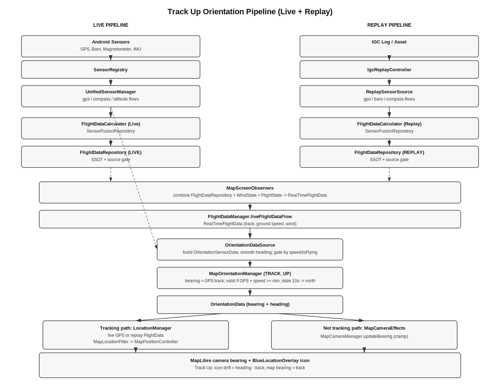
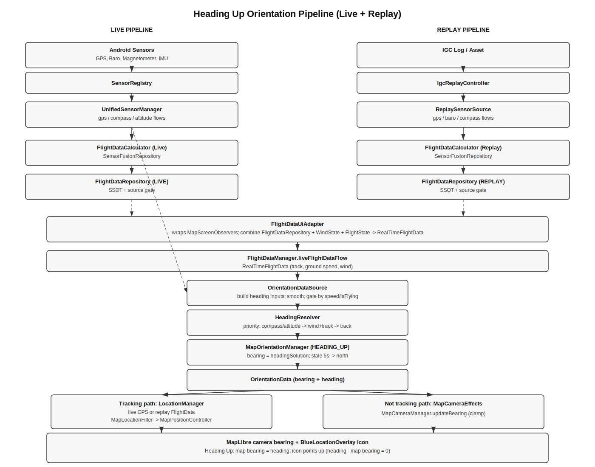

# Orientation (MapScreen)

This is the master reference for map orientation in XCPro. It covers the architecture, data flow, and shared behavior across all orientation modes. Mode-specific details live in:
- `docs/Orientation/TrackUp.md`
- `docs/Orientation/HeadingUp.md`

Note: app/device orientation is locked to portrait in the manifest (`app/src/main/AndroidManifest.xml`). That is separate from map orientation.




## User-facing entry points

1) Settings > General > Orientation
   - Screen: `feature/map/src/main/java/com/example/xcpro/screens/navdrawer/OrientationSettingsScreen.kt`
   - Entry in General settings grid: `feature/map/src/main/java/com/example/xcpro/screens/navdrawer/Settings-df.kt`
   - Navigation route: `app/src/main/java/com/example/xcpro/AppNavGraph.kt` (`orientation_settings`)
   - Lets the user set separate modes for Cruise/Final Glide and Thermal/Circling, plus glider vertical offset.

2) Map screen compass widget
   - Toggle control: `feature/map/src/main/java/com/example/xcpro/map/ui/OverlayPanels.kt` and
     `feature/map/src/main/java/com/example/xcpro/map/ui/MapScreenSections.kt`
   - Cycles: NORTH_UP -> TRACK_UP -> HEADING_UP -> NORTH_UP
   - Updates the active profile in preferences via `MapOrientationManager.setOrientationMode()`.

## High-level data flow (live)

```
UnifiedSensorManager (compass, attitude)        FlightDataManager (RealTimeFlightData)
           |                                                 |
           v                                                 v
OrientationDataSource  <---- updateFromFlightData() ---- MapOrientationManager
           |                                                 |
           v                                                 v
     OrientationSensorData                         OrientationData (mode, bearing, valid, source)
           |                                                 |
           +--------------------- MapScreenRoot collects ----+
                                     |
                                     v
                 MapComposeEffects + LocationManager / MapCameraEffects
                                     |
                                     v
                      MapLibre camera bearing + BlueLocationOverlay icon
```

Key files:
- Orientation contracts: `core/common/src/main/java/com/example/xcpro/common/orientation/OrientationContracts.kt`
- Orientation manager: `feature/map/src/main/java/com/example/xcpro/MapOrientationManager.kt`
- Orientation data source: `feature/map/src/main/java/com/example/xcpro/OrientationDataSource.kt`
- Heading resolver (HEADING_UP): `feature/map/src/main/java/com/example/xcpro/orientation/HeadingResolver.kt`
- Location / camera updates: `feature/map/src/main/java/com/example/xcpro/map/LocationManager.kt`
- Camera effects and clamping: `feature/map/src/main/java/com/example/xcpro/map/MapCameraManager.kt`
- Location jitter gate: `feature/map/src/main/java/com/example/xcpro/map/MapLocationFilter.kt`
- Icon rotation policy: `feature/map/src/main/java/com/example/xcpro/map/IconHeadingSmoother.kt`
- Icon rendering: `feature/map/src/main/java/com/example/xcpro/map/BlueLocationOverlay.kt`
- Orientation UI: `feature/map/src/main/java/com/example/xcpro/CompassWidget.kt`

## Orientation modes (behavior summary)

`MapOrientationMode` enum: `NORTH_UP`, `TRACK_UP`, `HEADING_UP`.

Map bearing and icon behavior:
- NORTH_UP: map bearing = 0. Icon rotates to track.
- TRACK_UP: map bearing = GPS track. Icon shows drift (heading - track).
- HEADING_UP: map bearing = heading solution. Icon points up.

Note: `OrientationData` carries both the map bearing and a separate heading
(`headingDeg/headingValid/headingSource`) so UI can rotate the aircraft icon as
`heading - mapBearing` (XCSoar convention).

## Icon rotation vs heading validity

### Current behavior (icon-rotation policy)
- `OrientationData.headingValid` is computed by `OrientationDataSource` / `HeadingResolver` and
  indicates whether the heading solution is stable (sensor reliability + speed gate + staleness).
- Map bearing respects validity in `MapOrientationManager` (HEADING_UP can fall back to north or
  last-known bearing when heading is invalid).
- Icon rotation is gated by `headingValid` plus a speed hysteresis band derived from
  `MapOrientationPreferences.getMinSpeedThreshold()`.
- When heading is invalid or below the exit threshold, the icon holds the last stable heading
  or falls back to track (Track Up / North Up) or map bearing (Heading Up).
- In North Up, track is used only when speed is above the enter threshold; otherwise the icon
  holds the last stable heading.
- Rotation uses time-based smoothing and an angular-velocity clamp, plus a small deadband
  for micro-rotations.
- This remains visual-only and uses the display clock time base. It does not modify SSOT data.

Mode-specific deep dives:
- Track Up: `docs/Orientation/TrackUp.md`
- Heading Up: `docs/Orientation/HeadingUp.md`

## Tracking vs not tracking (camera application)

There are two camera pipelines:

A) Tracking mode (default when return button is not shown)
- Path: `MapComposeEffects.LocationAndPermissionEffects` -> `LocationManager.updateLocationFromGPS()`.
- Uses `MapLocationFilter` to accept or reject position updates.
- Camera bearing uses `OrientationData.bearing`.
- Bearing can update even when the position is rejected (bearing-only update).
- No camera bearing clamp in this path.

B) Not tracking (user has panned; return button is shown)
- Path: `MapCameraEffects.OrientationBearingEffect` -> `MapCameraManager.updateBearing()`.
- Bearing is clamped per update (`MAX_BEARING_STEP_DEG = 5`).
- Small changes are ignored (`bearingChanged` threshold ~2 degrees).

## Shared gates and smoothing (important knobs)

1) Orientation update throttle
- `MapOrientationManager.BEARING_UPDATE_THROTTLE_MS = 66` (~15Hz)

2) Heading smoothing and stale detection (Heading Up inputs)
- `OrientationDataSource.SMOOTHING_FACTOR = 0.3`
- `HEADING_UPDATE_INTERVAL_MS = 50` (20Hz cap)
- `HEADING_STALE_THRESHOLD_MS = 1500`

3) Track min-speed gate
- `MapOrientationPreferences.getMinSpeedThreshold()` default 2 m/s (stored as m/s)

4) Track stale timeout (Track Up)
- `MapOrientationManager.TRACK_STALE_TIMEOUT_MS = 10000` (Track Up falls back to north)

5) Location jitter gate
- `MapLocationFilter` rejects location updates if movement < `thresholdPx` (default 0.5 px)

6) Track bearing clamp (display)
- `MapPositionController.clampBearingStep()` limits the displayed track to 5 deg/step

7) Camera bearing clamp (not tracking path)
- `MapCameraManager.updateBearing()` limits rotation step to 5 deg/step

8) User override freeze
- `MapOrientationManager.onUserInteraction()` freezes bearing updates for 10s
- Triggered by pan/rotate in `MapInitializer`

9) Icon rotation policy
- Heading validity gate + speed hysteresis for rotation
- Time-based smoothing + max angular velocity clamp
- Deadband for micro-rotation

## Further improvements (optional)

These are optional extensions beyond the current icon-rotation policy.

1) Accuracy-aware smoothing (implemented)
- Display smoothing scales track filtering using bearing accuracy when available.
- Icon rotation scales deadband and max turn rate when falling back to track (heading invalid).
- Heading-valid rotation does not use GPS bearing accuracy.
- Replay fixes currently provide null accuracy fields (default behavior).

2) Configurable icon smoothing toggle
- Wire `MapOrientationPreferences.KEY_BEARING_SMOOTHING` to enable/disable extra icon smoothing
  while keeping the heading-valid gate in place.

3) Refined fusion for icon only
- Use a blended heading for the icon (track + heading weighting) while keeping camera bearing
  aligned to the selected orientation mode.

## XCSoar parity highlights (orientation)

Sources are the XCSoar repo under `C:\Users\Asus\AndroidStudioProjects\XCSoar`.

- Track is updated only when moving (> 2 m/s).
  - `src/Device/Parser.cpp` (`NMEAParser::RMC`)
  - `src/NMEA/Info.hpp` (`MovementDetected`)
- Track expires after ~10s without updates; Track Up falls back to north.
  - `src/NMEA/Info.cpp` (`Expire`)
  - `src/MapWindow/GlueMapWindowDisplayMode.cpp` (`UpdateScreenAngle`)
- Heading validity expires after 5s.
  - `src/NMEA/Attitude.cpp` (`AttitudeState::Expire`)
- If no compass heading is available, XCSoar computes heading from track + wind when flying,
  else from track; this is stored in `basic.attitude.heading`.
  - `src/Computer/BasicComputer.cpp` (`ComputeHeading`)
- Heading Up map rotation uses `basic.attitude.heading` if available; otherwise north.
  - `src/MapWindow/GlueMapWindowDisplayMode.cpp` (`UpdateScreenAngle`)
- Icon drift behavior aligned:
- XCSoar draws aircraft rotation as `basic.attitude.heading - screen_angle`.
  That means Heading Up -> icon points up, Track Up -> icon shows drift.
    - `src/MapWindow/MapWindowRender.cpp`
- XCPro now matches this convention.
    - `feature/map/src/main/java/com/example/xcpro/map/BlueLocationOverlay.kt`

## XCSoar parity implementation (Heading Up)

Detailed parity implementation (items 1-3) lives in:
- `docs/Orientation/HeadingUp.md` -> "XCSoar parity implementation (items 1-3)"

Summary of the implemented changes:
1) Heading Up stale timeout (5s) -> reset to north when heading is invalid too long.
2) Movement gate default aligned to 2 m/s.
3) Wind-derived heading gated by `isFlying` (no wind-heading when stationary).

## Debugging checklist (orientation bugs)

If the map or icon looks wrong, check these signals first:
- `OrientationData.bearing`, `OrientationData.isValid`, `OrientationData.bearingSource`
- GPS track and ground speed (speed gate may be failing)
- Heading reliability (compass/attitude freshness)
- Camera bearing (`MapLibreMap.cameraPosition.bearing`)
- Whether `MapLocationFilter` is rejecting updates
- Whether user override freeze is active (10s)

Relevant log tags:
- `MapOrientationManager`
- `OrientationDataSource`
- `HeadingResolver`
- `LocationManager`
- `MapCameraManager`
- `MapLocationFilter`
- `CompassWidget`

## Adding or changing orientation behavior

Use the mode-specific docs for Track Up and Heading Up. For new modes:
- Add enum entry in `MapOrientationMode` and update `MapOrientationManager.calculateBearing()`.
- Update camera/icon behavior in `LocationManager` and `BlueLocationOverlay`.
- Wire UI (settings + compass cycle).

Do not bypass architecture rules in `ARCHITECTURE.md` or `CODING_RULES.md`.


